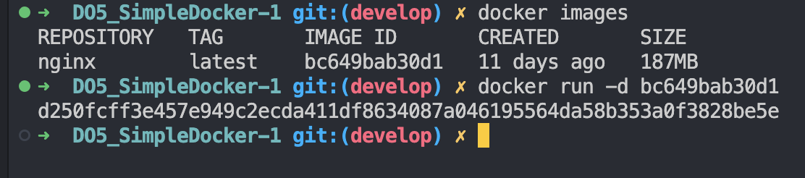
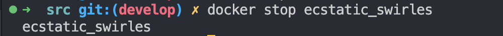

# Part 1. Готовый докер

Написание докер образа для собственного веб сервера
В начале нужно разобраться с уже готовым докер образом для сервера.
Выбор пал на **nginx**.

## Взять официальный докер образ с **nginx** и выкачать его при помощи `docker pull`

Для этого предварительно неоходимо установить сам докер на компьютер 

`docker pull nginx`

## Проверить наличие докер образа через `docker images`

## Запустить докер образ через `docker run -d [image_id|repository]`

` docker run -d bc649bab30d1 `

## Проверить, что образ запустился через `docker ps`

## Посмотреть информацию о контейнере через `docker inspect [container_id|container_name]`

## По выводу команды определить и поместить в отчёт размер контейнера, список замапленных портов и ip контейнера

Для удобства воспользуемся  `docker inspect` вместе с `grep`

### Размер контейнера

`docker inspect d250fcff3e45 --size | grep Size`

### Список замапленных портов

`docker inspect d250fcff3e45 --size | grep Ports -A 2`

### ip контейнера

`docker inspect d250fcff3e45 --size | grep IPAddress`

## Остановить докер образ через `docker stop [container_id|container_name]`

`docker stop d250fcff3e45`

## Проверить, что образ остановился через `docker ps`

##### Запустить докер с портами 80 и 443 в контейнере, замапленными на такие же порты на локальной машине, через команду *run*

`docker run -d -p 80:80 -p 443:443 nginx`

## Проверить, что в браузере по адресу *localhost:80* доступна стартовая страница **nginx**

## Перезапустить докер контейнер через `docker restart [container_id|container_name]`

Узнаем имя контейнера `docker ps` - `ecstatic_swirles`

`docker restart ecstatic_swirles`

## Проверить любым способом, что контейнер запустился

Исппользуем `docker ps`

# Part 2. Операции с контейнером

Докер образ и контейнер готовы. 
Теперь конфигурации **nginx** и отображение статуса страницы.

## Прочитать конфигурационный файл *nginx.conf* внутри докер контейнера через команду *exec*

`docker exec ecstatic_swirles cat /etc/nginx/nginx.conf`

## Создать на локальной машине файл *nginx.conf*

`docker exec ecstatic_swirles cat /etc/nginx/nginx.conf >> nginx.conf`

## Настроить в нем по пути */status* отдачу страницы статуса сервера **nginx**

## Скопировать созданный файл *nginx.conf* внутрь докер образа через команду `docker cp`

`docker cp src/nginx.conf ecstatic_swirles:/etc/nginx`

## Перезапустить **nginx** внутри докер образа через команду *exec*

`docker exec ecstatic_swirles nginx -s reload`

## Проверить, что по адресу *localhost:80/status* отдается страничка со статусом сервера **nginx**

## Экспортировать контейнер в файл *container.tar* через команду *export*

`docker export ecstatic_swirles > container.tar`

## Остановить контейнер

`docker stop ecstatic_swirles`

## Удалить образ через `docker rmi [image_id|repository]`, не удаляя перед этим контейнеры

`docker rmi -f nginx`

## Удалить остановленный контейнер

`docker rm ecstatic_swirles`

## Импортировать контейнер обратно через команду *import*

`docker import -c 'cmd ["nginx", "-g", "daemon off;"]' container.tar nginx`

## Запустить импортированный контейнер

`docker run -d -p 80:80 -p 443:443 8ec9687630df`

## Проверить, что по адресу *localhost:80/status* отдается страничка со статусом сервера **nginx**

# Part 3. Мини веб-сервер

Cвой сервер.

## Написать мини сервер на **C** и **FastCgi**, который будет возвращать простейшую страничку с надписью `Hello World!`

## Запустить написанный мини сервер через *spawn-fcgi* на порту 8080

Запускаем с портами 80 и 81 ак как ебхдимо проксировать с 81 порта на 80 

`docker run -d -p 80:80 -p 81:81 nginx`

## Написать свой *nginx.conf*, который будет проксировать все запросы с 81 порта на *127.0.0.1:8080*

## Положить файл *nginx.conf* по пути *./nginx/nginx.conf* (это понадобится позже)

Конфигурация прописана, осталось добавить файлы в контейнер 

`docker cp nginx.conf admiring_elgamal:/etc/nginx`

`docker exec ecstatic_swirles nginx -s reload

`docker cp server.c admiring_elgamal:/home`

И также у нашего контейнера нет компилятора чтобы запустить написанный мини сервер через *spawn-fcgi*

По этому обновляем 

`docker exec admiring_elgamal apt-get update`

Скачиваем нужные пакеты gcc и spawn-fcgi

`docker exec admiring_elgamal apt-get install -y gcc libfcgi-dev spawn-fcgi`

Компилируем 

`docker exec admiring_elgamal gcc -o server /home/server.c -lfcgi`

Запускаем 

`docker exec admiring_elgamal spawn-fcgi -p 8080 ./server`

## Проверить, что в браузере по *localhost:81* отдается написанная вами страничка

# Part 4. Свой докер

## Пишем свой докер образ, который:
### 1) собирает исходники мини сервера на FastCgi из Части 3
### 2) запускает его на 8080 порту
### 3) копирует внутрь образа написанный *./nginx/nginx.conf*
### 4) запускает **nginx**.

Для такого рода сборки создаем докер файл 

В нем у нас будет набор команд для обновления, скачивания пакетов и копирования файлов из директории сборки или можно прописать относительный/абсолютный путь до файлов

Далее копируем файлы в директорию сборки(в моем случае src) из прошлой части - nginx.conf, server.c

Также нам нужен скрипт который скомпилирует и запустит нужный нам файл для сервера и примет конфигурации nginx - run.sh

## Собираем написанный докер образ через `docker build` при этом указав имя и тег

`docker build -t knapptan:1 .` где имя  - мой ник, а тег 1

## Проверяем через `docker images`, что все собралось корректно

## Запустить собранный докер образ с маппингом 81 порта на 80 на локальной машине и маппингом папки *./nginx* внутрь контейнера по адресу, где лежат конфигурационные файлы **nginx**'а 

`docker run -d -p 80:81 -v /Users/knapptan/Desktop/Projects/DO5_SimpleDocker-1/src/nginx.conf:/etc/nginx/nginx.conf -d knapptan:1 bash`

## Проверить, что по localhost:80 доступна страничка написанного мини сервера

## Дописываем в *./nginx/nginx.conf* проксирование странички */status*, по которой надо отдавать статус сервера **nginx**

## Перезапустить докер образ
*Если всё сделано верно, то, после сохранения файла и перезапуска контейнера, конфигурационный файл внутри докер образа должен обновиться самостоятельно без лишних действий*

`docker restart heuristic_euclid`

## Проверить, что теперь по *localhost:80/status* отдается страничка со статусом **nginx**

# Part 5. **Dockle**

## Просканировать образ из предыдущего задания через `dockle [image_id|repository]`

`dockle knapptan:1`

Ошибки которые нобходимо исправить: 
FATAL   - CIS-DI-0010: Do not store credential in environment variables/files
FATAL   - DKL-DI-0005: Clear apt-get caches
WARN    - CIS-DI-0001: Create a user for the container

Для этого правим докерфайл: 
добавим user - добавляю  конце чтобы не было конфликтов при вызове команд, 
удалим после настройки файлы которые уже не нужны - кеш списка пакетов.
И сменим nginx на debian - базовый образ так как nginx хранит ENV-ключ NGINX_GPGKEY,
который не проходит проверку dockle.
Можно использовать Docker Secrets или другие методы для хранения конфиденциальных данных.
В данном случае просто не используем эти данные.

## Исправить образ так, чтобы при проверке через **dockle** не было ошибок и предупреждений

# Part 6. Базовый **Docker Compose**

## Написать файл *docker-compose.yml*, с помощью которого:

### 1) Поднять докер контейнер из Части 5 _(он должен работать в локальной сети, т.е. не нужно использовать инструкцию **EXPOSE** и мапить порты на локальную машину)_
### 2) Поднять докер контейнер с **nginx**, который будет проксировать все запросы с 8080 порта на 81 порт первого контейнера
## Замапить 8080 порт второго контейнера на 80 порт локальной машины

## Остановить все запущенные контейнеры

## Собрать и запустить проект с помощью команд `docker-compose build` и `docker-compose up`

`docker-compose build`

`docker-compose up -d`

Флаг -d в команде docker-compose up означает "в фоновом режиме" (detached)

`docker ps`

Проверяем првильность работы

## Проверить, что в браузере по *localhost:80* отдается написанная вами страничка, как и ранее

